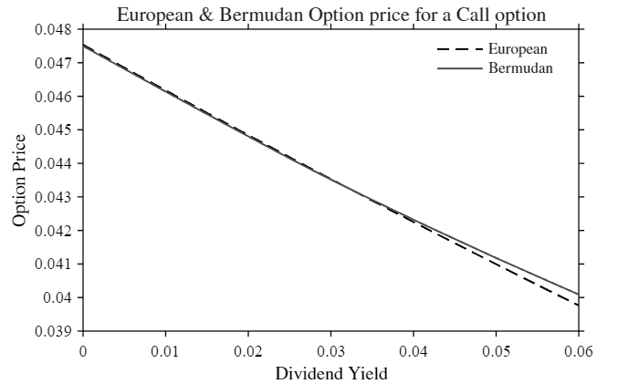

<a id="TMP_8d55"></a>

# <span style="color:rgb(213,80,0)">**1 \- OPTION PRICING**</span>
<!-- Begin Toc -->

## Table of Contents
&emsp;[**EXERCISE 1: Option Pricing**](#TMP_7372)
 
&emsp;&emsp;[**SETUP**](#TMP_4bbe)
 
&emsp;&emsp;[**UPLOAD DATA**](#TMP_9f18)
 
&emsp;&emsp;[**POINT A**](#TMP_4b68)
 
&emsp;&emsp;[**POINT B**](#TMP_1567)
 
&emsp;&emsp;[**POINT C**](#TMP_6253)
 
&emsp;&emsp;[**POINT D**](#TMP_032c)
 
&emsp;&emsp;[**POINT E**](#TMP_3d40)
 
&emsp;&emsp;[**POINT F**](#TMP_16ec)
 
&emsp;&emsp;[**POINT G**](#TMP_5a94)
 
&emsp;&emsp;[**POINT H**](#TMP_176b)
 
<!-- End Toc -->
<a id="TMP_7372"></a>

# **EXERCISE 1: Option Pricing**

Price a European Call Option with the following characteristics: 

|||
| :-- | :-- |
| strike price <br>  | 1 € <br>   |
| value date <br>  | 15th of February 2008 <br>   |
| time\-to\-maturity (ttm) <br>  | 3 month (consider a yearfrac 1/4) <br>   |
| volatility <br>  | 22% (per year) <br>   |
| ttm\-zero\-rate <br>  | 3% <br>   |
| underlying <br>  | equity stock <br>   |
| dividend yield <br>  | 6% <br>   |
| settlement <br>  | physical delivery <br>   |
| number of contracts <br>  | 1 Mln € <br>   |
| underlying price <br>  | 1 € <br>   |

<a id="TMP_4bbe"></a>

## **SETUP**
```matlab
% Initialize workspace
clc; clear; close all;

% Fix randomness
rng('default');   

% Add shared library folder
addpath(genpath(fullfile('..','..','lib')));

% Add project-specific folders
addpath(genpath('src'));
addpath(genpath('data'));
addpath(genpath('results'));

% Define paths
resultsPath = fullfile('results');
figuresPath = fullfile('results', 'figures');
srcPath = fullfile('src');
dataRawPath = fullfile('data', 'raw');
dataInterimPath = fullfile('data', 'interim');
dataProcessedPath = fullfile('data', 'processed');
```
<a id="TMP_9f18"></a>

## **UPLOAD DATA**
```matlab
% Load option parameters
load(fullfile(dataRawPath, 'params.mat'), 'params');

% Underlying future price
S0 = params.S0;

% Strike price
K = params.K;

% ttm zero rate
r = params.r;

% Yield
q = params.q;

% ttm
T = params.T;

% Volatility
sigma = params.sigma;

% Notional
notional = params.N;

% Knock-In Barrier
KI = params.KI;

% Compute the discount factor
B = exp(-r * T);

% Compute the forward price
F0 = S0 * exp((r - q) * T);

% Set the flag:
% For European Call = +1
% For European Put  = -1
optionType = 1;
```
<a id="TMP_4b68"></a>

## **POINT A**

Price the option, considering an underlying price equal to 1 Euro (i.e a derivative Notional of 1 Mln Euro): 

1.  via blkprice Matlab function;
2. with a CRR tree approach;
3. with a Monte\-Carlo (MC) approach.
```matlab
% 1.
optionPriceBLK = EuropeanOptionClosed(S0, K, r, q, T, sigma, optionType);
fprintf('Closed formula price: %.4f €', optionPriceBLK);
```

```matlabTextOutput
Closed formula price: 0.0398 €
```

```matlab
% 2.
nStep = 1e2;
optionPriceCRR = EuropeanOptionCRR(S0, K, r, q, T, sigma, nStep, optionType);
fprintf('CRR price: %.4f €', optionPriceCRR);
```

```matlabTextOutput
CRR price: 0.0398 €
```

```matlab
% 3.
nSim = 1e6;
[optionPriceMC, ~] = EuropeanOptionMC(S0, K, r, q, T, sigma, nSim, optionType);
fprintf('Monte Carlo price: %.4f €', optionPriceMC);
```

```matlabTextOutput
Monte Carlo price: 0.0397 €
```

<a id="TMP_1567"></a>

## **POINT B**

Focus on a call. Select M according to the criteria discussed, consider M:

1.  as the number of intervals in CRR;
2. as the number of simulations in the MC.
```matlab
% 1.
TuneCRR(S0, K, r, q, T, sigma, optionType);
```

```matlabTextOutput
CRR tuned steps: 16 
Black-76 Price: 0.0398 € 
CRR Price: 0.0397 € 
Error: 0.000046
```

```matlab
% 2.
TuneMC(S0, K, r, q, T, sigma, optionType);
```

```matlabTextOutput
MC tuned steps: 524288 
Black-76 Price: 0.0398 € 
MC Price: 0.0398 € 
Error: 0.000090
```

<a id="TMP_6253"></a>

## **POINT C**

Show that the numerical errors for a call rescale with M:

1.   as $\frac{1}{M}$ for CRR;
2. as $\frac{1}{\sqrt{M}}$ for MC.
```matlab
% 1. 
[nStep, errCRR] = PlotErrorCRR(S0, K, r, q, T, sigma);

figCRR = figure;
loglog(nStep, errCRR, '-', 'DisplayName', 'CRR'); hold on;
loglog(nStep, 1./nStep, '--', 'DisplayName', '$\frac{1}{M}$');
PlotUtils.setStyle();
PlotUtils.setLabels('Number of Steps', 'Error', ...
    'Error Rescaling for CRR (log-log scale)');
PlotUtils.setLegend();
```

<center></center>


```matlab
% 2. 
[nSim, errMC] = PlotErrorMC(S0, K, r, q, T, sigma);

figMC = figure;
loglog(nSim, errMC, '-', 'DisplayName', 'MC'); hold on;
loglog(nSim, 1./sqrt(nSim), '--', 'DisplayName', '$\frac{1}{\sqrt{M}}$');
PlotUtils.setStyle();
PlotUtils.setLabels('Number of Simulations', 'Error', ...
    'Error Rescaling for MC (log)');
PlotUtils.setLegend(); 
```

<center></center>

<a id="TMP_032c"></a>

## **POINT D**

Price also a European Call Option with European barrier at 1.3 € (UP & IN) and same parameters with:

1.  closed formula;
2. CRR;
3. MC.
```matlab
% 1.
optionPriceKIBLK = EuropeanOptionKIClosed(S0, K, KI, r, q, T, sigma);
fprintf('Closed formula price: %.4f €', optionPriceKIBLK);
```

```matlabTextOutput
Closed formula price: 0.0037 €
```

```matlab
% 2.
nStep = 1e2;
optionPriceKICRR = EuropeanOptionKICRR(S0, K, KI, r, q, T, sigma, nStep);
fprintf('CRR price: %.4f €', optionPriceKICRR);
```

```matlabTextOutput
CRR price: 0.0037 €
```

```matlab
% 3.
% WARNING: Slow execution, set to 1e3 to speed up but the approximation will be poor
nStep = 1e3;
nSim = 1e6;
optionPriceKIMC = EuropeanOptionKIMC(S0, K, KI, r, q, T, sigma, nStep, nSim);
fprintf('Monte Carlo formula price: %.4f €', optionPriceKIMC);
```

```matlabTextOutput
Monte Carlo formula price: 0.0036 €
```

<a id="TMP_3d40"></a>

## **POINT E**

For this barrier option, with the underlying price in the range 0.60 € and 1.20 €, plot the $\Gamma$ using:

1.  the closed formula;
2. a numerical estimate.
```matlab
% Define range of prices
S0Range = linspace(0.6, 1.2, 100);

% 1.
gammaClosed = zeros(1, length(S0Range));
priceClosed = zeros(1, length(S0Range));
for i = 1:length(S0Range)
    priceClosed(i) = EuropeanOptionKIClosed(S0Range(i), K, KI, r, q, T, sigma);
    gammaClosed(i) = GammaKI(S0Range(i), K, KI, r, q, T, sigma, NaN, NaN, 1);
end

% 2. 
% Use CRR tree (MC is too slow)
nStep = 1e3;
gammaCRR = zeros(1, length(S0Range));
priceCRR = zeros(1, length(S0Range));
for i = 1:length(S0Range)
    priceCRR(i) = EuropeanOptionKICRR(S0Range(i), K, KI, r, q, T, sigma, nStep);
    gammaCRR(i) = GammaKI(S0Range(i), K, KI, r, q, T, sigma, NaN, nStep, 2);
end

% Plot prices 
figPrices = figure;
plot(S0Range, priceClosed, '--', 'DisplayName', 'Closed'); hold on;
plot(S0Range, priceCRR, '-', 'DisplayName', 'CRR');
PlotUtils.setStyle();
PlotUtils.setLabels('Underlying Price', 'Option Price', ...
    'Option price for an Up & In European Call option');
PlotUtils.setLegend(); 
```

<center></center>


```matlab
% Plot gamma
figGamma = figure;
plot(S0Range, gammaClosed, '--', 'DisplayName', 'Closed'); hold on;
plot(S0Range, gammaCRR, '-', 'DisplayName', 'CRR');
PlotUtils.setStyle();
PlotUtils.setLabels('Underlying Price', '$\Gamma$', ...
    '$\Gamma$ for an Up \& In European Call option');
PlotUtils.setLegend(); 
```

<center></center>

<a id="TMP_16ec"></a>

## **POINT F**

Does antithetic variables technique reduce MC error of point B? 

```matlab
% MC
TuneMC(S0, K, r, q, T, sigma, optionType);
```

```matlabTextOutput
MC tuned steps: 524288 
Black-76 Price: 0.0398 € 
MC Price: 0.0397 € 
Error: 0.000090
```

```matlab
% MC AV
TuneMCAV(S0, K, r, q, T, sigma, optionType);
```

```matlabTextOutput
MC AV steps: 262144 
Black-76 Price: 0.0398 € 
MC AV Price: 0.0398 € 
Error: 0.000072
```

<a id="TMP_5a94"></a>

## **POINT G**

Price also, with the Tree, a Bermudan option, where the holder has also the right to exercise the option at the end of every month, obtaining the stock at the strike price. 

```matlab
% Price with built-in CRR (for comparison)
nStep = 3e2;
optionPriceCRR = BermudanOptionCRRExact(S0, K, r, q, T, sigma, nStep);
fprintf('Financial Toolbox CRR price: %.4f €', optionPriceCRR);
```

```matlabTextOutput
Financial Toolbox CRR price: 0.0400 €
```

```matlab
% Price with CRR
nStepPerMonth = 1e2;
optionPriceCRR = BermudanOptionCRR(S0, K, r, q, T, sigma, nStepPerMonth);
fprintf('Implemented CRR price: %.4f €', optionPriceCRR);
```

```matlabTextOutput
Implemented CRR price: 0.0401 €
```

<a id="TMP_176b"></a>

## **POINT H**

Pricing the Bermudan option, vary the dividend yield between 0% and 6% and compare with the corresponding European price.

```matlab
% Define dividend range
qRange = linspace(0.00, 0.06, 100);

% Compute European and Bermudan prices
europeanPrices = zeros(1, length(qRange));
bermudanPrices = zeros(1, length(qRange));
nStepPerMonth = 1e2;
for i = 1:length(qRange)
    europeanPrices(i) = EuropeanOptionClosed(S0, K, r, qRange(i), T, sigma, 1);
    bermudanPrices(i) = BermudanOptionCRR(S0, K, r, qRange(i), T, sigma, nStepPerMonth);
end

% Plot prices
figDividend = figure;
plot(qRange, europeanPrices, '--', 'DisplayName', 'European'); hold on;
plot(qRange, bermudanPrices, '-', 'DisplayName', 'Bermudan');
PlotUtils.setStyle();
PlotUtils.setLabels('Dividend Yield', 'Option Price', ...
    'European & Bermudan Option price for a Call option');
PlotUtils.setLegend(); 
```

<center></center>

