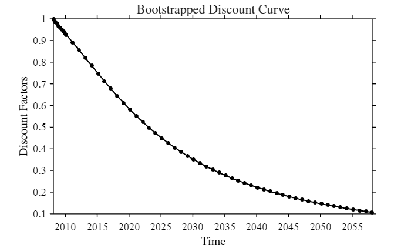
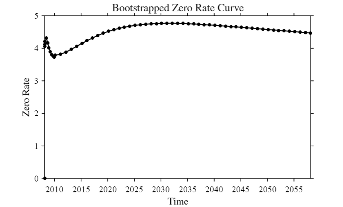

<a id="TMP_4984"></a>

# <span style="color:rgb(213,80,0)">**2 \- INTEREST RATES BOOTSTRAP**</span>
<!-- Begin Toc -->

## Table of Contents

&emsp;[**EXERCISE 1: Bootstrap for Euribor 3M Interbank curve**](#TMP_688f)

&emsp;&emsp;[**SETUP**](#TMP_49ae)

&emsp;&emsp;[**UPLOAD DATA**](#TMP_5ebc)

&emsp;&emsp;[**BOOTSTRAP DISCOUNT AND ZERO RATES**](#TMP_4168)

&emsp;[**EXERCISE 2: Sensitivities for an IRS**](#TMP_9e46)

&emsp;&emsp;[**SETUP**](#TMP_8cc9)

&emsp;&emsp;[**UPLOAD DATA**](#TMP_8f43)

&emsp;&emsp;[**COMPUTE SENSITIVITIES**](#TMP_430a)

<!-- End Toc -->
<a id="TMP_688f"></a>

# **EXERCISE 1: Bootstrap for Euribor 3M Interbank curve**

Considering the inter\-bank market on the 15th of February 2008 at 10:45 C.E.T. Implement the code necessary to realize the bootstrap for the Discount Factors' curve (with a single\-curve model). Output values should be on settlement date and expires of quoted underlings. Hints: include in the datesSet of the bootstrap only end dates of underlying contracts.

<a id="TMP_49ae"></a>

## **SETUP**

```matlab
clc; clear; close all;
addpath(genpath(fullfile('..', '..', 'lib')));
InitializeProject();
```

<a id="TMP_5ebc"></a>

## **UPLOAD DATA**

```matlab
% Load market rates
filename = fullfile(pathDataRaw, 'MktData_CurveBootstrap');
dateFormat = 'dd/MM/yyyy';
[datesSet, ratesSet] = ReadExcelData(filename, dateFormat);
```

<a id="TMP_4168"></a>

## **BOOTSTRAP DISCOUNT AND ZERO RATES**

```matlab
% Generate bootstrapped discount curve
[dates, discounts] = Bootstrap(datesSet, ratesSet);

% Compute respective zero rates
zeroRates = ZeroRates(dates, discounts);

% Plot results
figDISC = figure;
plot(dates, discounts, '-o', 'DisplayName', 'Bootstrapped Discount'); hold on;
PlotUtils.setStyle();
PlotUtils.setLabels('Time', 'Discount Factors', ...
    'Bootstrapped Discount Curve');
```

<center></center>

```matlab
figZRATES = figure;
plot(dates, 100 * zeroRates, '-o', 'DisplayName', 'Bootstrapped Zero Rates');
PlotUtils.setStyle();
PlotUtils.setLabels('Time', 'Zero Rate', ...
    'Bootstrapped Zero Rate Curve');
```

<center></center>

<a id="TMP_9e46"></a>

# **EXERCISE 2: Sensitivities for an IRS**

With the discount curve obtained above compute the absolute value of the quantities specified below for a portfolio composed only by one single swap. A 6y plain vanilla IR swap vs Eurbibor 3m with a fixed rate 2.817% and a Notional of €10 Mln:

1. DV01\-parallel shift;
2. DV01(z)\-parallel shift;
3. BPV of the 5y IRS;

For "I.B. coupon bond" with same expiry, fixed rate & reset dates of the IRS, and face value equal to IRS Notional:

1. its Macaulay Duration.
<a id="TMP_8cc9"></a>

## **SETUP**

```matlab
clc; clear; close all;
addpath(genpath(fullfile('..', '..', 'lib')));
InitializeProject();
```

<a id="TMP_8f43"></a>

## **UPLOAD DATA**

```matlab
% Compute discounts and shifted discounts
BootstrapCurves = load(fullfile(pathLib, 'BootstrapCurves.mat'));
dates = BootstrapCurves.dates;
discounts = BootstrapCurves.discounts;
zeroRatesShift = ZeroRates(dates, discounts) + 1e-4;
discounts_DV01 = Discounts(dates, zeroRatesShift);

% Load IR Swap data
SwapData = load(fullfile(pathDataRaw, 'SwapData.mat'));
setDate = SwapData.SettlementDate;
fixedLegPaymentDates = SwapData.FixedLegDates;
fixedRate = SwapData.FixedRate;
```

<a id="TMP_430a"></a>

## **COMPUTE SENSITIVITIES**

```matlab
% Compute IR Swap sensitivities
[DV01, BPV, DV01_z] = SensSwap(setDate, fixedLegPaymentDates, fixedRate, dates, discounts, discounts_DV01);

% Compute IB Coupon Bond sensitivities
MacD = SensCouponBond(setDate, fixedLegPaymentDates, fixedRate, dates, discounts);

% Display Results
T = table(DV01 * 1e4, DV01_z * 1e4, BPV * 1e4, MacD, ...
    'VariableNames', {'DV01', 'DV01 Zero Rates', 'BPV', 'Maculay Duration'}, ...
    'RowNames', {'Sensitivities (bps)'});
display(T);
```

| |DV01|DV01 Zero Rates|BPV|Maculay Duration|
|:--:|:--:|:--:|:--:|:--:|
|1 Sensitivities (bps)|5.2049|5.2049|5.2399|5.5901|
